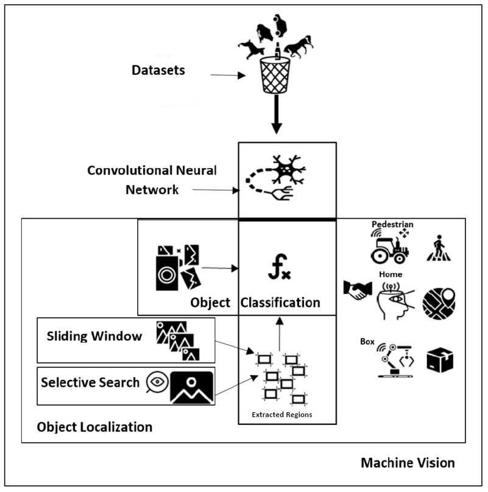

Hi Everyone, 

##Object Detection




 ```python
 a, b = 0, 1
while b < 10:
    print(b)
    a, b = a, a + b
  ```


##Sliding Window


<iframe width="409" height="150" src="https://www.youtube.com/embed/Em37ucxvx74" title="YouTube video player" frameborder="0" allow="accelerometer; autoplay; clipboard-write; encrypted-media; gyroscope; picture-in-picture" allowfullscreen></iframe>


 💪


